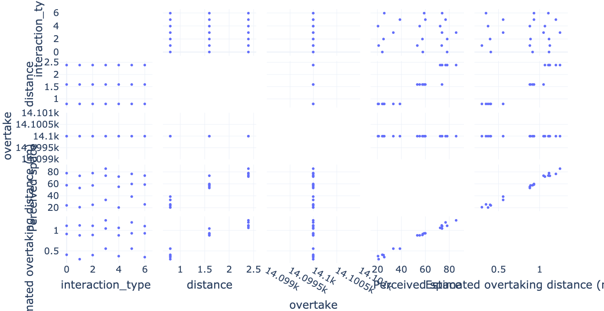
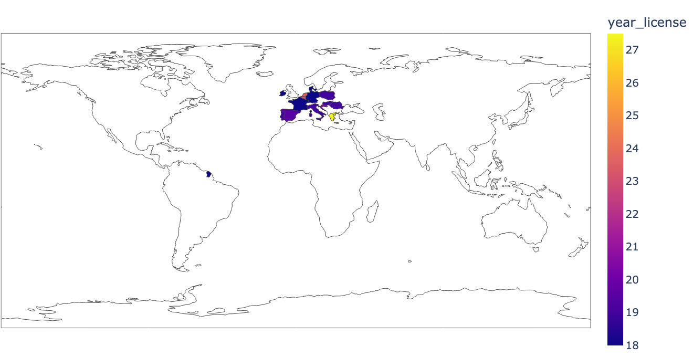
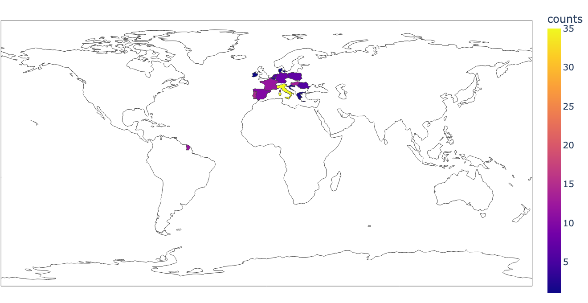
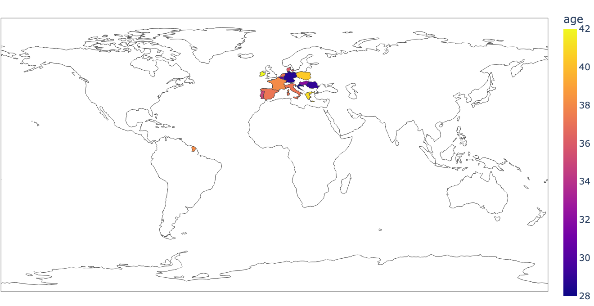
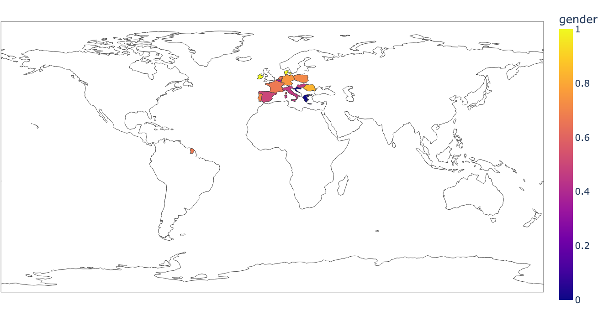

# Enhancing lateral overtaking distance for cyclist safety in the EU
This project defines a framework for evaluating different technologies in a traffic environment involving a cyclist and a vehicle. The jsPsych framework is used for the frontend. In the description below, it is assumed that the repository is stored in the folder cyclist-distance-crowdsourced. Terminal commands assume macOS.

## Setup
Tested with Python 3.9.12. To setup the environment run these two commands in a parent folder of the downloaded repository (replace `/` with `\` and possibly add `--user` if on Windows):
- `pip install -e cyclist-distance-crowdsourced` will setup the project as a package accessible in the environment.
- `pip install -r cyclist-distance-crowdsourced/requirements.txt` will install required packages.

### Configuration of project
Configuration of the project needs to be defined in `cyclist-distance-crowdsourced/config`. Please use the `default.config` file for the required structure of the file. If no custom config file is provided, `default.config` is used. The config file has the following parameters:
* `appen_job`: ID of the appen job.
* `num_stimuli`: number of stimuli in the study.
* `num_stimuli_participant`: subset of stimuli in the study shown to each participant.
* `allowed_min_time`: the cut-off for minimal time of participation for filtering.
* `num_repeat`: number of times each stimulus is repeated.
* `kp_resolution`: bin size in ms in which data is stored.
* `mask_id`: number for masking worker IDs in appen data.
* `allowed_stimulus_wrong_duration`: if the percentage of videos with abnormal length is above this value, exclude participant from analysis.
* `files_heroku`: files with data from heroku.
* `files_appen`: files with data from appen.
* `files_simulator`: files with data from the simulator experiment.
* `file_cheaters`: CSV file with cheaters for flagging.
* `path_source`: path with source files for the stimuli from the Unity3D project.
* `path_stimuli`: path consisting of all videos included in the survey.
* `mapping_stimuli`: CSV file that contains all data found in the videos.
* `plotly_template`: template used to make graphs in the analysis.
* `stimulus_width`: width of stimuli.
* `stimulus_height`: height of stimuli.
* `aoi`: csv file with AOI data.
* `smoothen_signal`: toggle to apply filter to smoothen data.,
* `freq`: frequency used by One Euro Filter.
* `mincutoff`: minimal cutoff used by One Euro Filter.
* `beta`: beta value used by One Euro Filter.
* `font_family`: font family to be used on the figures.
* `font_size`: font size to be used on the figures.
* `p_value`: p value used for ttest.
* `save_figures`: save "final" figures to the /figures folder.

## Preparation of stimuli
The source files of the video stimuli are outputted from Unity to `config.path_source`. To prepare them for the crowdsourced setup `python cyclist-distance-crowdsourced/preparation/process_videos.py`. Videos will be outputted to `config.path_stimuli`.

## Analysis
Analysis can be started by running python `cyclist-distance-crowdsourced/dcycl/run.py`. A number of CSV files used for data processing are saved in `cyclist-distance-crowdsourced/_output`. Visualisations of all data are saved in `cyclist-distance-crowdsourced/_output/figures/`.

## Keypress data
### All participants

Percentage of participants pressing the response key as a function of elapsed video time for all stimuli for all participants.

Percentage of participants pressing the response key as a function of elapsed video time for all stimuli grouped by distance.

Percentage of participants pressing the response key as a function of elapsed video time for grouped scenarios.

### Keypress Percentage by Scenario

 Percentage of participants pressing the response key as a function of elapsed video time and responses to post-stimulus questions for scenario 1.

Percentage of participants pressing the response key as a function of elapsed video time and responses to post-stimulus questions for scenario 2.

Percentage of participants pressing the response key as a function of elapsed video time and responses to post-stimulus questions for scenario 3.

Percentage of participants pressing the response key as a function of elapsed video time and responses to post-stimulus questions for scenario 4.

Percentage of participants pressing the response key as a function of elapsed video time and responses to post-stimulus questions for scenario 5.

Percentage of participants pressing the response key as a function of elapsed video time and responses to post-stimulus questions for scenario 6.

Percentage of participants pressing the response key as a function of elapsed video time and responses to post-stimulus questions for scenario 7.

### Simulator experiment

Mean distance of overtaking in the simulator experiment.

Mean speed of overtaking in the simulator experiment.

Preferences of concepts in simulator experiment.

Average overtaking distance over time for different scenario.

#### Correlation and scatter matrices

Correlation matrix.

  
Scatter matrix.

<!-- ## Area of Interest (AOI)
### For all participants

Participants end slider responses to which scenario was most helpful.

Participants end slider responses experienced to stress. -->

#### Information on participants

Participants driving experiences.

  
Year of obtaining driver's license.

  
Map of counts of participants.

  
Map of age of participants.

  
Map of distribution of gender.

Participants cycling experiences.

## Troubleshooting
### Troubleshooting setup
#### ERROR: cyclist-distance-crowdsourced is not a valid editable requirement
Check that you are indeed in the parent folder for running command `pip install -e cyclist-distance-crowdsourced`. This command will not work from inside of the folder containing the repo.

